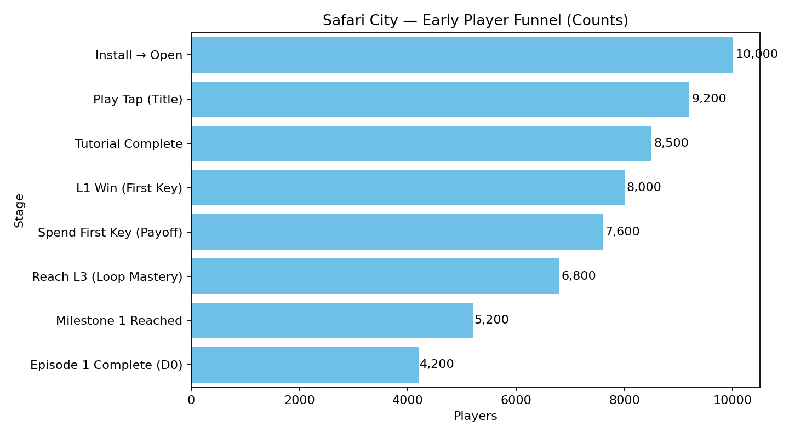
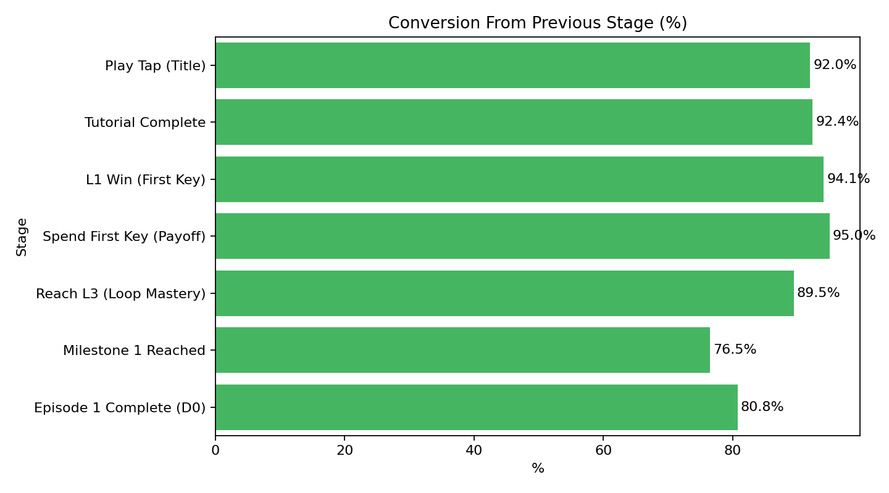

## Safari City — Early Journey Analysis (3–4 page brief)

### 1) Executive Summary
- Onboarding is strong (tutorial completion high). Largest early friction appears when players move into the autonomous loop (L2–L3) and before Episode‑1 completion (pacing/payoff gap).
- Key economy is clear, but a small share earn a key and delay spending it — fix with instant feedback and guided camera.
- Free boosters appear in ~25–30% of early levels in your playthrough — good for momentum when used to teach/rescue; avoid trivializing easy boards.
- Priorities: smooth L2–L3 difficulty + ad‑continue on 2nd fail; make first key‑spend instant/obvious; structure free‑booster grants; add periodic big reveals; shift monetization after Episode‑1.

### 2) Early Player Funnel (visuals)

Embed the generated charts (exported from the notebook):

Stage definition (condensed):
Install → Open → Play Tap → Tutorial Complete → L1 Win (First Key) → Spend First Key (Payoff) → Reach L3 → Milestone 1 → Episode‑1 Complete

Key KPIs to monitor:
- Tutorial completion ≥ 85%
- Time to first key ≤ 5 min
- Earned→Spent within 60s ≥ 95%
- L1/L2/L3 win rates ≥ 90/85/80%
- D0 Episode‑1 completion 35–55%

### 3) Insights from Data and Playthrough
- Largest drop in sample funnel: Reach L3 (autonomous loop), then Milestone→Episode‑1 (pacing fatigue).
- Small but important gap: L1 win → key spend (discoverability/latency).
- Out‑of‑Moves and “Don’t Give Up” prompts can end sessions if pay‑gated too early.
- ~3 free boosters across ~10–12 early levels: works best when spaced and tied to learning or rescuing after a fail.

Details live in: `Funnel_Insights_and_Recommendations.md`.

### 4) Segmentation Map (Task 2)

Segments and rationale are documented in `Task2_Player_Segmentation_Safari_City.md`. Summary:
- Beginners: learning loop; needs tips and clear key‑spend CTA.
- Stuck/At‑Risk: fail‑streak or spend friction; prioritize ad‑continue and soft DDA.
- Fast/Momentum: quick wins; unlock skips, streaks, optional challenges.
- Booster‑Reliant: high booster use/continues; teach efficient use; value packs later.
- Decorators/Completion‑Focused: many spends vs levels; emphasize themes, collections, before/after.

### 5) Recommendations (prioritized, with success metrics)
1) Smooth L2–L3 + protect early continues
   - Action: ad‑continue on 2nd fail for L2–L4; gem continues after Episode‑1.
   - Metric: Raise L2–L3 conversion; cut early rage‑quits.

2) Make first key spend instant and obvious
   - Action: key pop + counter increment at win; auto‑pan to task; pulsing spend target.
   - Metric: ≥95% spend within 60s; higher satisfaction events.

3) Structure free‑booster grants to teach/rescue
   - Action: 1 tutorial grant (L1–L2), 1 fail‑streak grant (L3–L4), 1 milestone grant.
   - Metric: Win‑lift with vs without booster ≤15 pts on L2–L3; otherwise soften boards.

4) Increase meaning of early payoffs
   - Action: bundle micro tasks into a big reveal every ~5 minutes; add short narrative beats.
   - Metric: Improve Milestone→Episode‑1 conversion, session length stable.

5) Monetization ramp after Episode‑1
   - Action: shift to rewarded‑ad continues; introduce value‑focused starter pack; segment offers by behavior.
   - Metric: ARPDAU lift without lowering early retention.

6) Ensure inclusivity for outdated devices
   - Action: provide a lightweight build variant (reduced textures/effects), lower min‑OS where safe, add device capability checks to auto‑route players to the optimal build, and support intermittent connectivity.
   - Metric: Lower crash/ANR rates on low‑end devices; higher install success rate on legacy OS; parity in session start rate.

### 6) Supporting Files
- Data: `Firebase_overview - Firebase_overview.csv`, `Firebase_overview.xlsx`
- Notebook: `SafariCity_Funnel_Analysis.ipynb` (generates charts and text)
- Funnel one‑pager: `Task1_Funnel_Safari_City.md`
- Segmentation one‑pager: `Task2_Player_Segmentation_Safari_City.md`
- Insights summary: `Funnel_Insights_and_Recommendations.md`
- Exports: `funnel_counts.png`, `funnel_conversion.png`

Notes
- Update `funnel_counts` in the notebook with your cohort to refresh numbers and this report’s visuals.

### 7) CRISP‑DM Summary (Early Player Behavior)

- Business Goal: Improve early retention, engagement, and monetization.
- Business Questions:
  - How many install (`first_open`)?
  - What % complete a level (`level_end`)?
  - What % purchase (`in_app_purchase`)?
  - What % uninstall (`app_remove`)?
  - What are stage‑to‑stage conversion rates and top drop‑offs?

- Key Metrics (from Firebase overview):
  - Level completion rate = `level_end / first_open`
  - Purchase rate = `in_app_purchase / first_open`
  - Uninstall rate = `app_remove / first_open`
  - Avg sessions per player = `session_start / first_open`

- Insights (typical thresholds):
  - If level completion < 60% → onboarding/difficulty needs simplification.
  - If purchase < 1% → add a low‑cost Starter IAP after Level 1.
  - If uninstall > 20% → reduce friction, strengthen early payoff.
  - If avg sessions < 3 → add daily streak/login rewards and re‑engagement.

- Recommendations:
  1) Onboarding optimization (contextual guidance, softer early boards).
  2) Starter IAP ($0.99) after Level 1 with boosters/coins.
  3) Retention loops (daily streak rewards, short‑term quests).
  4) Re‑engagement (24–48h notifications for inactive players).
  5) Level balancing and A/B tests for L1–L3.

Implementation: a Plotly funnel and metrics extractor are available in the notebook; see the added "Firebase funnel (CRISP‑DM)" cell for code to read `Firebase_overview.xlsx` and visualize installs → level → purchase → uninstall with rounded labels.

